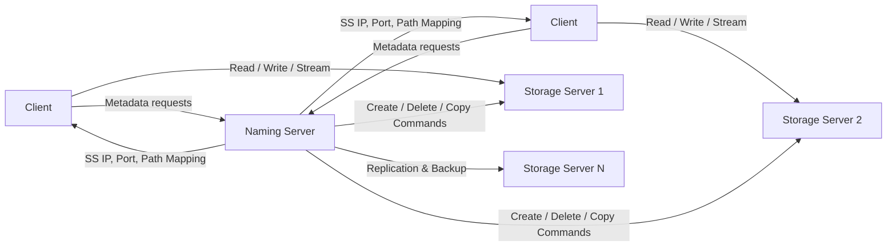
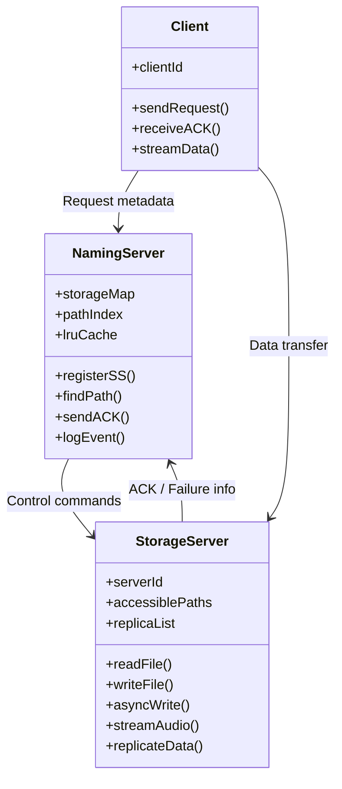
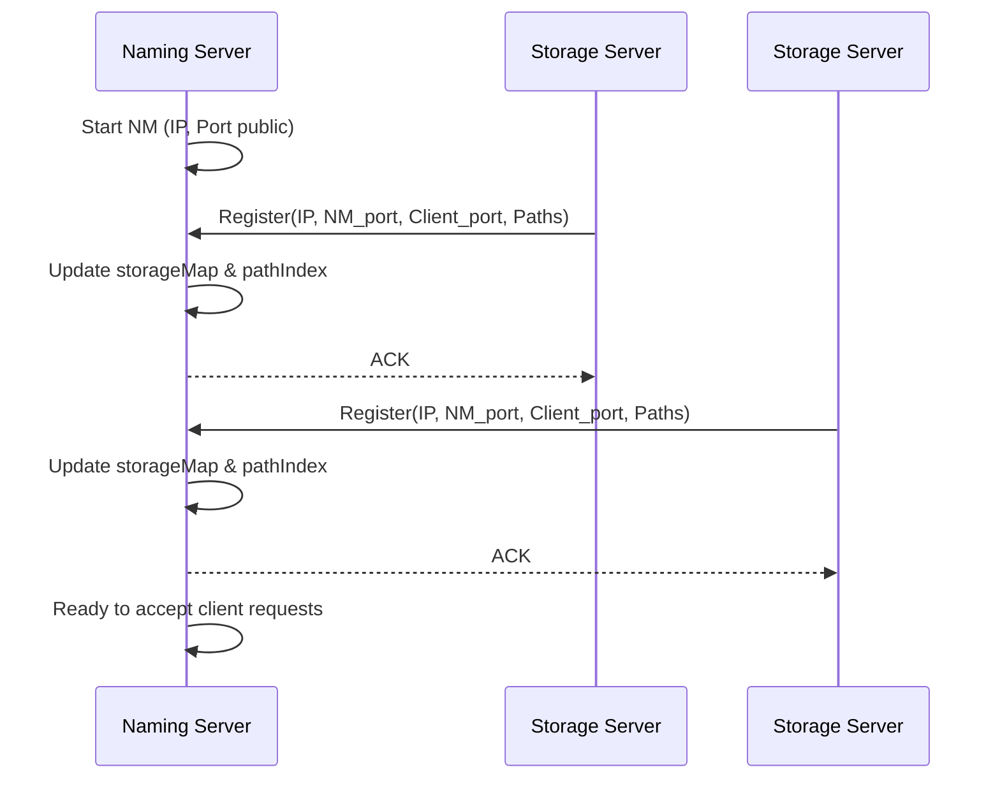
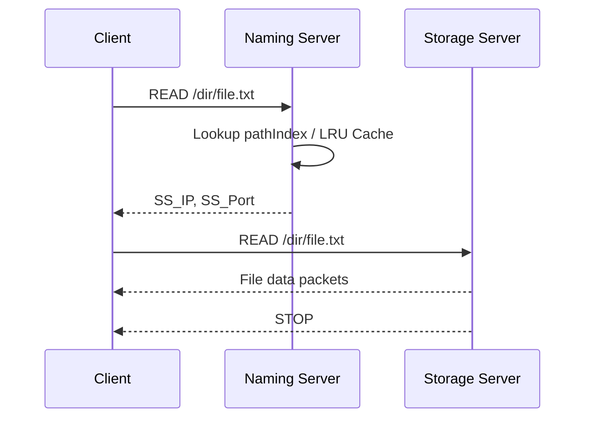
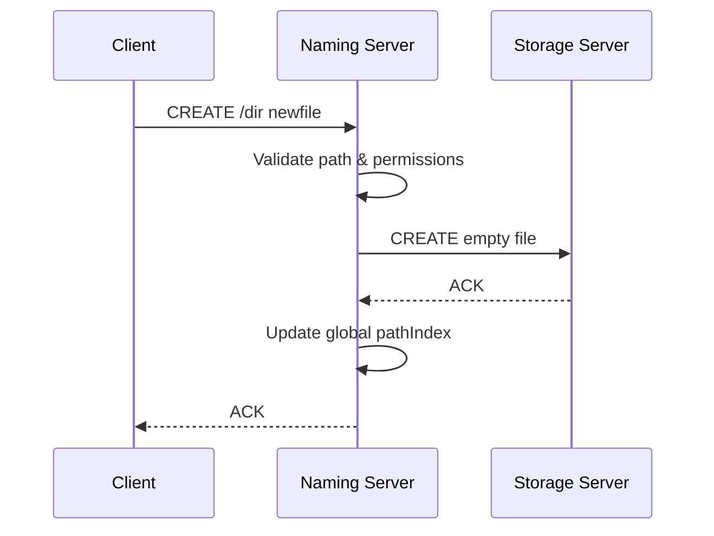
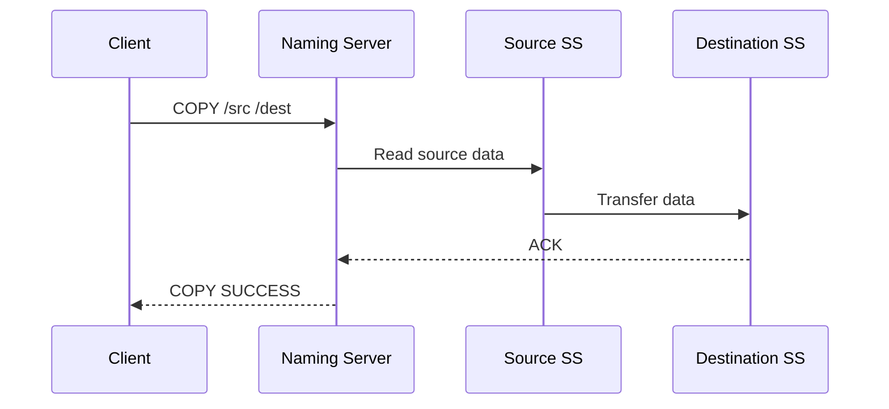
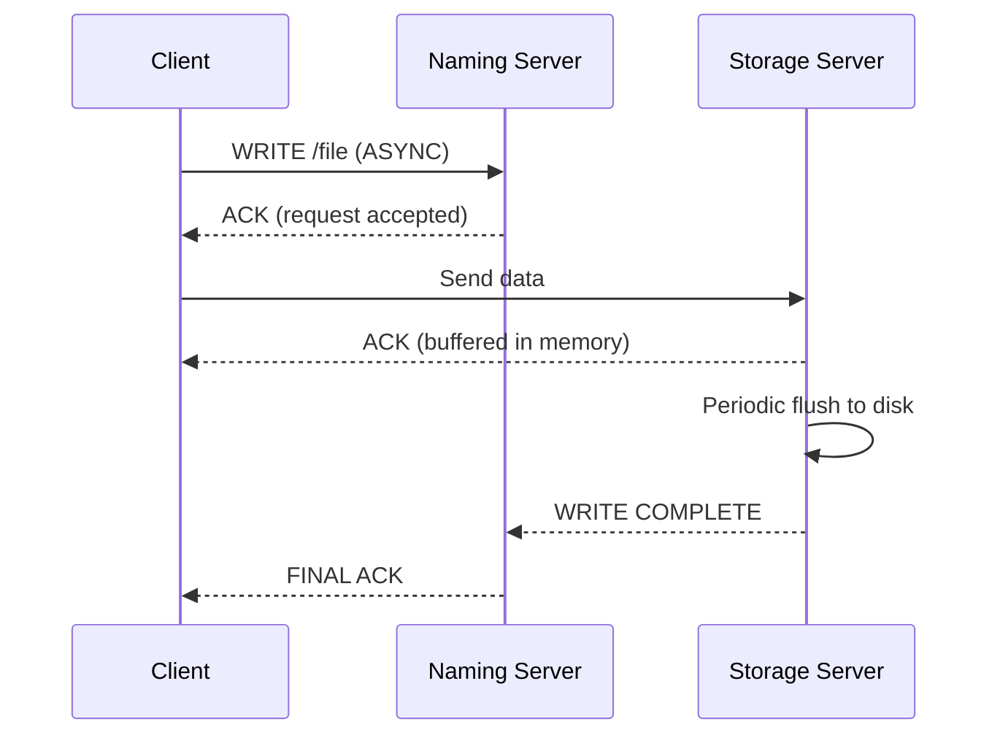
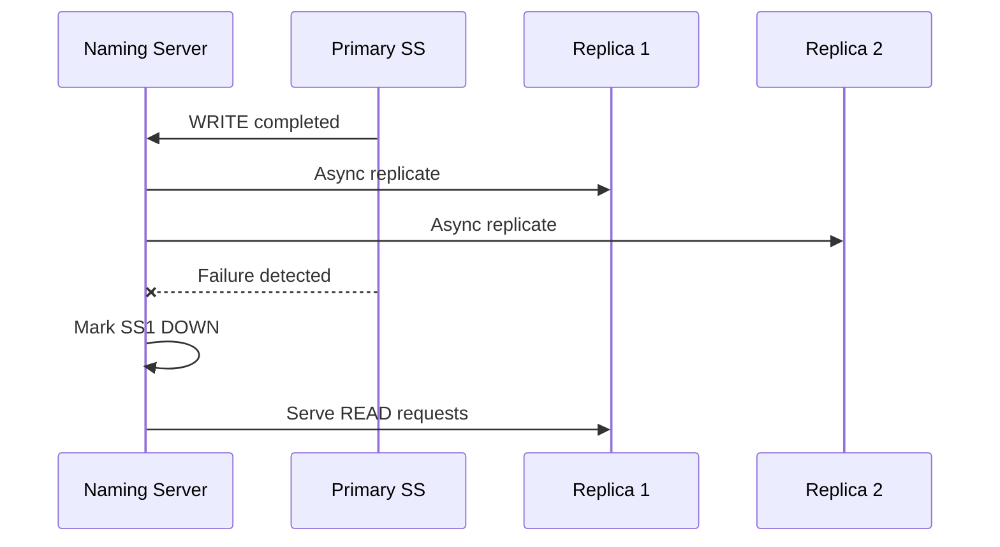
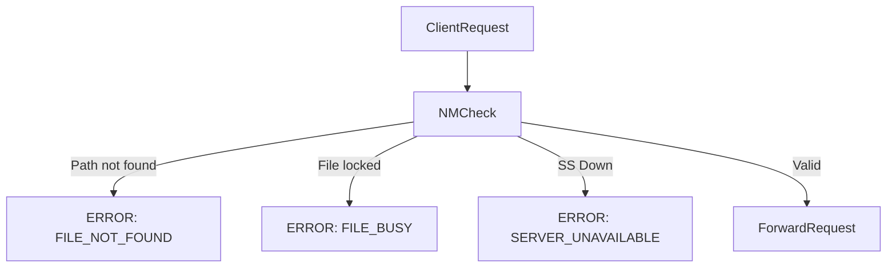

# Project Explaination 🕵🏻‍♂️
## 1️⃣ High-Level Architecture (System UML – Component Diagram)

This explains **who talks to whom and why**.

**What this shows clearly**

* NM is **control plane**
* SS is **data plane**
* Clients **never browse storage blindly**

---

## 2️⃣ Class Diagram (Logical UML Design)

This shows **responsibilities**, not implementation.

💡 **Evaluator takeaway**: clean separation of concerns (very OS-ish).

---

## 3️⃣ Initialization Sequence (NM + SS Registration)

This one scores **big marks** because many miss it.

---

## 4️⃣ READ File Operation (Client → NM → SS)

✔ Shows **NM not blocking**
✔ Shows **direct client–SS data path**

---

## 5️⃣ CREATE File / Directory (NM-Mediated)

📌 Notice: **NM updates metadata**, not SS.

---

## 6️⃣ COPY Between Storage Servers (SS ↔ SS via NM)

✔ Works even if source & destination are same SS
✔ NM acts as **orchestrator**

---

## 7️⃣ Asynchronous Write (High-Scoring Diagram)

💥 Shows:

* Reduced client latency
* Failure notification via NM
* Correct async semantics

---

## 8️⃣ Replication & Failure Handling

✔ Matches **Spec 3.5 exactly**

---

## 9️⃣ Error Handling Flow

---

## 🔟 What You Can Claim Confidently in Viva / Resume

You can safely say:

* **“Control plane & data plane separation”**
* **“Non-blocking naming server with async acknowledgements”**
* **“Fault-tolerant replicated storage with failure detection”**
* **“Optimized lookup using Trie/HashMap + LRU cache”**

---
